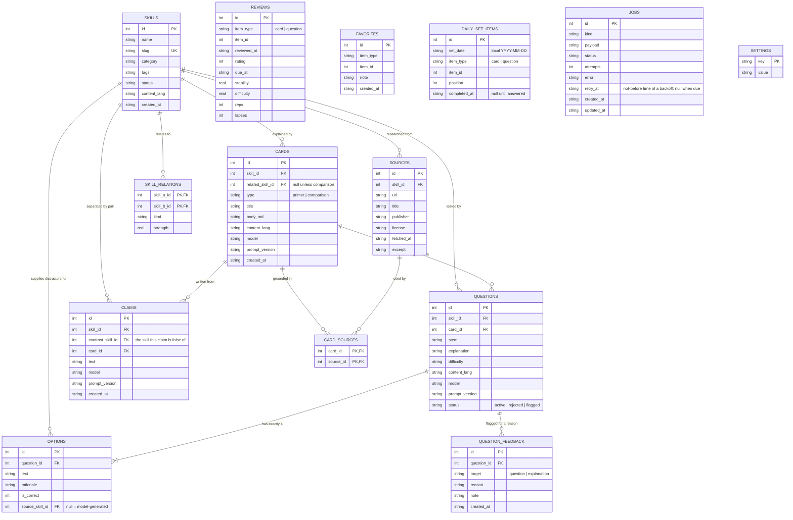

# Entity Relationship Diagram

> **Purpose.** The shape of the data at a glance.
> **Related.** [database-design.md](database-design.md)

## ERD

## Entities

| Entity                  | What it is                                                                                                           |
| ----------------------- | -------------------------------------------------------------------------------------------------------------------- |
| `SKILLS`                | The root entity. Everything else hangs off a skill.                                                                  |
| `SKILL_RELATIONS`       | The graph — the part of the product nothing else offers.                                                             |
| `SOURCES`               | Provenance. Holds the extracted text the model actually saw.                                                         |
| `CARDS`                 | Generated teaching text: a primer for one skill, or a comparison between two.                                        |
| `QUESTIONS` / `OPTIONS` | Generated assessment. Exactly four options, exactly one correct.                                                     |
| `CLAIMS`                | One statement, true of `skill_id` and false of `contrast_skill_id` — what questions borrow their wrong answers from. |
| `QUESTION_FEEDBACK`     | Why the user flagged a question or its explanation.                                                                  |
| `REVIEWS`               | FSRS state per reviewed item — an append-only log, one row per answer.                                               |
| `DAILY_SET_ITEMS`       | Which ids belong to today's set, frozen once assembled.                                                              |
| `FAVORITES`             | What the user chose to keep.                                                                                         |
| `JOBS`                  | The durable queue driving all generation.                                                                            |
| `SETTINGS`              | Key-value preferences.                                                                                               |

## Relationships

- A **skill** has many sources, cards, questions, and relations.
- A **comparison card** points at two skills: `skill_id` and `related_skill_id`.
- A **card** cites many sources, and a source may back many cards — hence `CARD_SOURCES`.
- A **question** belongs to the card it was generated from, which is how an answer traces back to a source.
- An **option** may point at the sibling skill its distractor came from; `NULL` marks a model-generated distractor.
- A **claim** points at two skills: `skill_id` (what it is true of) and `contrast_skill_id` (what it is false of, and
  therefore safe to show as a wrong answer about).
- `REVIEWS`, `DAILY_SET_ITEMS`, `FAVORITES`, `JOBS`, and `SETTINGS` reference items polymorphically or not at all, so
  they carry no foreign keys — deliberate, so deleting a skill cannot cascade away review history or a saved
  favourite.

## Invariants

1. Every card has at least one row in `CARD_SOURCES`. A card without provenance is a bug.
2. Every question has exactly four options, exactly one with `is_correct = 1`.
3. Every option has a non-empty `rationale`.
4. `skill_relations` stores each pair once, with `skill_a_id < skill_b_id`.
5. Every generated row carries `model` and `prompt_version`.
6. A favourite outlives its skill; the UI marks it orphaned rather than deleting it.
