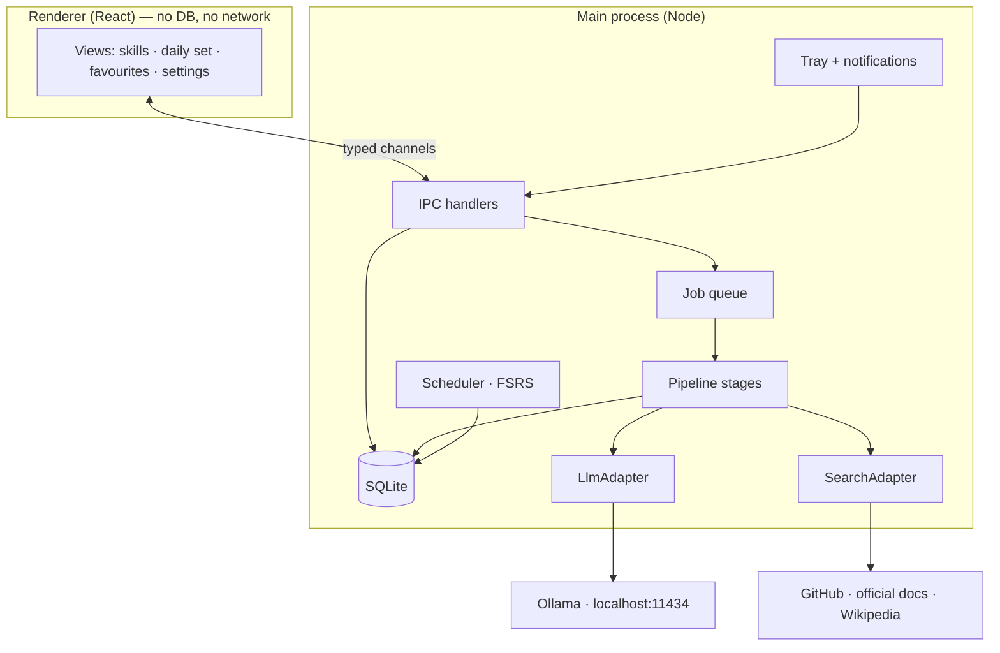

# Architecture Overview

> **Purpose.** How the system is put together and why it is shaped this way.
> **Related.** [system-design.md](system-design.md) · [adr/0001-initial-architecture.md](adr/0001-initial-architecture.md) · [../llm/architecture.md](../llm/architecture.md)

## Context

A single-user Windows desktop application. No server, no account, no shared state. It talks to exactly two things
outside itself: a local Ollama instance over HTTP, and public web sources during research.

The decision everything else follows from: **generation is separated from consumption.**

The user never waits on the model. Adding a skill enqueues background work that runs for minutes; the model is
loaded, used, and unloaded. Daily use — reading cards, answering questions — reads SQLite and nothing else. This is
what makes "local LLM" and "must not eat RAM" compatible, and it is why there is a job queue rather than a request
path.

## Components

| Component           | Responsibility                                                                         |
| ------------------- | -------------------------------------------------------------------------------------- |
| **Renderer**        | Presentation only. No database handle, no network, no Node integration.                |
| **IPC handlers**    | The single typed boundary between UI and everything privileged.                        |
| **Job queue**       | Durable, retryable background work. Survives restarts; a killed job resumes or resets. |
| **Pipeline stages** | ingest → retrieve → synthesize → classify → relate → generate → validate → persist.    |
| **Scheduler**       | FSRS state and daily-set assembly. Pure functions over stored state.                   |
| **LlmAdapter**      | The only code that knows Ollama exists.                                                |
| **SearchAdapter**   | The only code that knows which search providers exist.                                 |
| **SQLite**          | The single source of durable truth.                                                    |

## Data Flow

**Adding a skill.** UI → IPC → skill row (`pending`) + research job → queue picks it up → SearchAdapter returns
**candidates** → resolution gates reduce them to sources, or fail the job → text extracted and truncated →
LlmAdapter synthesizes a primer from _that text only_ → validation →
card and sources persisted → classification assigns category and tags → relations recomputed → comparison-card and
question jobs enqueued for affected pairs → model unloaded when the queue drains.

**A day of use.** UI → IPC → scheduler queries due items from SQLite → daily set returned → answers write review
state back. No model, no network, anywhere in this path.

## Tech Stack

| Layer      | Choice                                 | Why                                                                                                                                     |
| ---------- | -------------------------------------- | --------------------------------------------------------------------------------------------------------------------------------------- |
| Shell      | Electron + TypeScript                  | One language across UI and pipeline; the author's existing languages ([ADR-0001](adr/0001-initial-architecture.md))                     |
| UI         | React                                  | Ecosystem depth for a UI that has to be pleasant enough to use daily                                                                    |
| Build      | electron-vite, electron-builder        | Handles the three-target build (main / preload / renderer) and Windows packaging                                                        |
| Storage    | SQLite via `better-sqlite3`, FTS5      | Single file, local, synchronous API suits the main process, full-text search included                                                   |
| Validation | zod                                    | One source for both the JSON Schema sent to the runtime and the parse applied to its output                                             |
| LLM        | Ollama, local HTTP                     | Local, free, trivial HTTP integration; behind an adapter so it is replaceable                                                           |
| Search     | GitHub API + official docs + Wikipedia | Key-less by default — an open-source repo cannot ship a key. Every result passes resolution ([ADR-0003](adr/0003-source-resolution.md)) |
| Scheduling | FSRS                                   | Solved problem; not worth inventing                                                                                                     |
| Tests      | Vitest; Playwright for Electron later  | Adapters are stubbed, so tests never reach a model or the network                                                                       |

Toolchain versions are pinned together for a peer-dependency reason — see [../maintenance.md](../maintenance.md).

## Key Decisions

- [ADR-0001](adr/0001-initial-architecture.md) — Electron + TypeScript over Rust/Tauri, and the generation/consumption split.
- [ADR-0002](adr/0002-constrained-decoding.md) — JSON Schema sent to the runtime to constrain decoding, with the output still parsed.
- [ADR-0003](adr/0003-source-resolution.md) — a search result is a candidate, never a source; two gates stand between retrieval and grounding.

Decisions still open, with the evidence needed to close them, are listed in [../product/prd.md](../product/prd.md).
