# LLM Architecture

> **Purpose.** How the model is used, what it is and is not allowed to do, and where the quality risk sits.
> **Related.** [prompts.md](prompts.md) · [rag-sources.md](rag-sources.md) · [guardrails.md](guardrails.md) · [eval-harness.md](eval-harness.md)

## Approach

**Retrieval-augmented generation, run as an offline batch job.** Not a chatbot and not an agent.

The model is a _writer working from supplied material_, never a source of facts. Every card is produced from text
retrieved during that job. If retrieval fails, the job fails — the model is never allowed to fall back on its own
memory. That single rule is the product's main defence, because a small local model confidently inventing the
difference between nginx and Traefik destroys the only thing this product sells.

Generation is asynchronous and the user never waits on it. This is also what makes the memory budget work: the model
is loaded for a job and released when the queue drains ([../architecture/adr/0001-initial-architecture.md](../architecture/adr/0001-initial-architecture.md)).

## Model(s)

| Aspect      | Choice                                                                                                       |
| ----------- | ------------------------------------------------------------------------------------------------------------ |
| Runtime     | Ollama, local HTTP at `localhost:11434`                                                                      |
| Recommended | `qwen3:4b` (4B instruct, Q4, ~2.5 GB) — a working hypothesis, see below                                      |
| Selection   | Read from Ollama's installed list; the user picks                                                            |
| Structured  | JSON Schema sent as `format` on every request ([ADR-0002](../architecture/adr/0002-constrained-decoding.md)) |
| Thinking    | **`think: false` on every request** — see below; the largest latency factor in the pipeline                  |
| Context     | `num_ctx` set explicitly by the adapter, never inherited from the runtime                                    |
| Offload     | `num_gpu: 99` — forces every layer onto the GPU; the automatic split left 1.6 GB of VRAM unused              |
| Residency   | `keep_alive` of a few minutes during a job run; `release()` sends `keep_alive: 0` when the queue drains      |
| Concurrency | One job at a time — the model is both the bottleneck and the memory cost                                     |
| Access      | Via `LlmAdapter`; only `src/main/llm/ollama.ts` knows Ollama exists                                          |

### Thinking is off, and this was the biggest surprise

qwen3 is a hybrid reasoning model: left to itself it generates a reasoning trace before the answer. Measured on the
reference machine, same prompt, same schema, warm model:

|                | Total      | Generation | Output    |
| -------------- | ---------- | ---------- | --------- |
| `think: false` | **1.6 s**  | 1.5 s      | 43 tokens |
| thinking on    | **19.6 s** | 2.0 s      | 55 tokens |

The generation time is identical. The ~18 s difference is entirely a reasoning trace the user never sees, and an
earlier uncontrolled run reached **134 s** — so the cost is both large and variable.

None of this product's model tasks benefit from it. Writing prose from supplied text, classifying into a category,
and picking the right candidate from a short list are not reasoning problems; the material is already in the prompt.

This turned out to matter far more than GPU residency, which had been the assumed bottleneck. It is worth stating
plainly: **the thing that was measured and the thing that was worried about were not the same thing.**

### Model residency is the memory design

Ollama keeps a model resident for about five minutes after a request. Left at that default, the app would sit on
~5 GB long after the user stopped generating, which breaks the budget in
[../operations/performance.md](../operations/performance.md).

So `keep_alive` is passed explicitly: a short window during a job run, so consecutive jobs reuse the loaded weights,
and `0` from `release()` when the queue drains. This is the concrete implementation of ADR-0001's model-release rule,
not an optimization layered on top of it.

### Why 4B, and what would overturn it

An 8B Q4 model needs roughly 5 GB and does not fit the 4 GB laptop GPU this is developed on — a common
configuration, so a good share of users would be in the same position: the app would work, but slowly, on the
hardware they actually own.

So **development and production use the same 4B model**. There is no separate "dev model" and "quality model": the
model being built against is the one being recommended, which removes a whole class of decisions made on hardware
nobody has.

Two of the reasons a larger model would have been needed are already gone. Schema conformance moved to the runtime
([ADR-0002](../architecture/adr/0002-constrained-decoding.md)), and distractor assembly moved into code, drawing on
sibling skills' real properties rather than the model's invention
([../architecture/system-design.md](../architecture/system-design.md)). What is left for the model is writing prose
from supplied text, classifying, and picking the right candidate from a short list — the tasks a 4B model is most
likely to handle.

**This is a hypothesis, not a measured result.** The eval harness exists to falsify it. It would be overturned by:

- groundedness or distractor plausibility below the bar on the eval sets
- Turkish output degrading enough to be unusable, when English is fine
- resolution refusal failing — a model that always picks _something_ rather than answering "none"

Any of those escalates to an 8B model and a revised recommendation. Until then, one model is installed, and the disk
and VRAM cost stays at ~2.5 GB.

### What is still model-dependent

[ADR-0002](../architecture/adr/0002-constrained-decoding.md) removed one half of this problem: schema conformance is
now enforced by the runtime rather than earned by each model's prompt-following.

What remains is **content quality** — distractor sharpness, grounding discipline, and Turkish fluency vary by model,
and to the user that variance looks like a product bug. The two candidate answers are unchanged:

- a **supported-model allowlist**, refusing or warning on anything else, or
- **per-model prompt variants** selected by the model id.

Deciding between them needs two model families, and only one model is installed by choice
([TD-09](../project/tech-debt.md)). So this stays open longer than planned: v1 targets the model it is built on, and
the comparison happens when distribution makes it matter. Tracked as [TD-04](../project/tech-debt.md) and an open
question in [../product/prd.md](../product/prd.md).

## Data Sources

Retrieval only, no fine-tuning and no persistent vector index in v1.

| Source         | Role                                                                                     |
| -------------- | ---------------------------------------------------------------------------------------- |
| GitHub API     | Primary for tools. Searched `in:name`, never by stars. README plus the declared homepage |
| Official docs  | Fetched from the homepage the repository declares, so no search step can get it wrong    |
| Wikipedia API  | Secondary, strongest for **concepts** rather than tools — "what is a reverse proxy"      |
| Tavily / Brave | Optional, user's own key. Better reliability for users who want it                       |

No API key ships in the repository. DuckDuckGo was removed by [ADR-0003](../architecture/adr/0003-source-resolution.md).
Detail: [rag-sources.md](rag-sources.md).

## Flow

```mermaid
flowchart LR
    A[Skill added] --> B[Search: candidates]
    B -->|no candidates| X[Fail visibly]
    B --> R1[Gate 1: name match]
    R1 -->|none match| X
    R1 --> R2[Gate 2: subject check]
    R2 -->|none is the right subject| X
    R2 --> C[Extract + truncate to budget]
    C --> D[Synthesize primer]
    D --> E[Classify: category + tags]
    E --> F[Recompute relations]
    F --> G[Comparison cards for related pairs]
    D --> H[Generate questions]
    G --> H
    H --> I[Assemble distractors from siblings]
    I --> J[Validate structurally]
    J -->|reject| H
    J --> K[Persist with model + prompt_version]
    K --> L[Queue drains → release model]
```

Six distinct model tasks, each with its own prompt and its own eval coverage:

| Task                  | Input                                | Output                                           |
| --------------------- | ------------------------------------ | ------------------------------------------------ |
| **Resolve source**    | Candidate titles and lead paragraphs | Which candidate is the named technology, or none |
| **Synthesize primer** | Retrieved text for one skill         | 1–2 page card                                    |
| **Classify**          | Card and sources                     | Category + tags                                  |
| **Compare**           | Two skills' sources                  | Comparison card                                  |
| **Generate question** | A card, plus sibling facts           | Stem, correct option, rationales                 |
| **Explain**           | Question and options                 | Why each option is right or wrong                |

**Resolve source runs before any content is written**, and is the only model task whose failure is silent if it goes
wrong — the others produce visibly broken output, while a mis-resolved source produces a perfect-looking card about
the wrong subject ([ADR-0003](../architecture/adr/0003-source-resolution.md)).

Distractor assembly sits deliberately **outside** the model where it can: sibling facts are pulled from stored cards
by code, and the model is asked to use them rather than to invent them ([../architecture/system-design.md](../architecture/system-design.md)).

## Constraints

- **One LLM job at a time.** The model is both the bottleneck and the memory cost; parallelism doubles the footprint
  and buys nothing on a single-user desktop.
- **Every generated row records `model` and `prompt_version`.** Without them a regression cannot be attributed.
- **All generation returns JSON parsed against a schema.** Prose responses are a parse failure, not a fallback.
- **Retrieved text is untrusted input**, delimited as data and never concatenated as instructions ([guardrails.md](guardrails.md)).
- **Content language is a generation parameter**, not a post-translation step. Turkish quality on 8B models is a
  known open risk.
